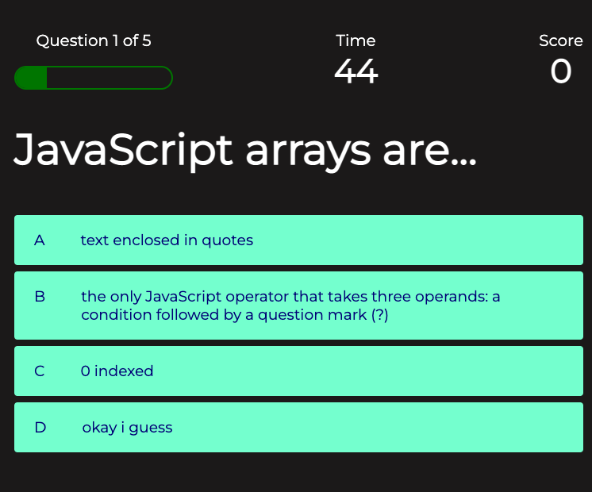

# Coding Quiz

## Description

The Coding Quiz is a game that allows you to test your JavaScript knowledge! Go against the clock and beat your own high score!

### Executing program

To get started, click "Play"

You have 60 seconds to complete the quiz. Click on the choice that you thikn is the right answer.

The display above the questions will show your progress, time left, and points accrued.

At the end, you can save your name and either play again or go back to the homepage.

From the Homepage, clicking "High Scores" will allow you to see the leaderboard.

## Authors

Samantha Gosselin
samanthag2009@gmail.com

## Version History

* 0.2
    * Re-tooled app in its entirety, researching methods learned in class since December 2022 and studying methods used by other programmers
* 0.1
    * Initial Release

## License

This project is licensed under the [NAME HERE] License - see the LICENSE.md file for details

## Acknowledgments

Inspiration, code snippets, etc.
* [awesome-readme](https://github.com/matiassingers/awesome-readme)
* [Brian Design YouTube Tutorial](https://www.youtube.com/watch?v=f4fB9Xg2JEY)
* [Rem in CSS](https://www.sitepoint.com/understanding-and-using-rem-units-in-css/)
* [Simple Steps Code](https://simplestepscode.com/javascript-quiz-tutorial/)